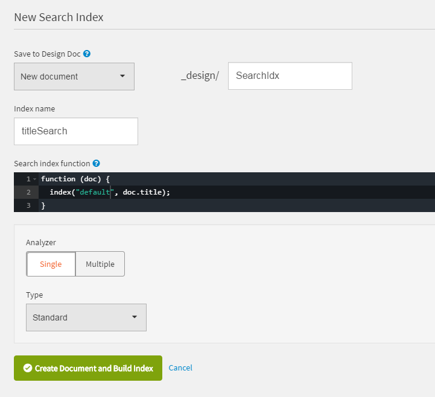
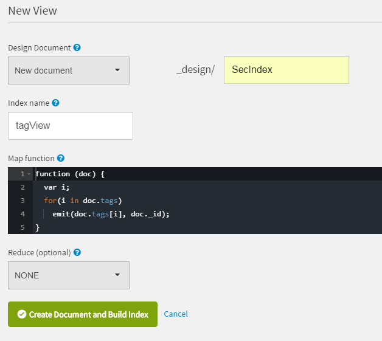

# Library server
A java server for a Library app.

Requires a Cloudant NoSQL Database.

## Deploy to Bluemix

1. Clone the app to your local environment from your terminal using the following command

      ```
      git clone https://github.com/florae123/library-server-java.git
      ```
2.  Execute full Maven build to create the target/name.war file:

      ```
      mvn clean install
      ```

      or use Eclipse to build the Maven project:
      * Launch Eclipse, Click **File > Import**. Then select **General > Existing Projects into Workspace**. Click **Next**.
      * Choose **Select root directory** and your downloaded directory *library-server-java*.
      * Right-click your *library-server-java* project folder in Eclipse and select **Run As > Maven install**. The *.war* file will be created in the *target* directory.

3. Log in to your Bluemix account using the Cloud Foundry CLI tool. Provide your username and password when prompted.
      ```
      cf login
      ```

4. Push the app to Bluemix using the cf cli command
      ```
      cf push MyName -p target/library-server-java.war
      ```
5. Create an instance of the Cloudant NoSQL DB Service on Bluemix and connect it to your app.

## Deploy to Bluemix using Eclipse

The software needed for following these steps:
Java SE 8 (JDK),
Eclipse Neon,
IBM Eclipse tools for Bluemix,
Cloud Foundry Command Line Interface

### Install the Bluemix plugin

To install the IBM Eclipse tools for Bluemix, launch Eclipse and click **Help > Eclipse Marketplace...**. Type *Bluemix* into the search panel and select **IBM Eclipse Tools for Bluemix for Neon**. Click **Install**, confirm the defaults, accept the license agreements and click **Finish**.

### Configure a server

To publish an Eclipse project to Bluemix, you will need to configure one or more servers in Eclipse.
For every organization and space in Bluemix, one server is necessary. So, if you want to work with multiple spaces, you must create multiple server configurations.

1. After launching Eclipse, select the Java EE perspective.

2. Click **File > New > Other**, select the **Server** wizard and click **Next**.

3. Select **IBM > IBM Bluemix** and name the server. Click **Next**.

4. Enter the email and password for your Bluemix account. Select the URL matching the region you are using. Click **Validate Account** and then **Next**.

5. Choose your organization and space and click **Finish**.

6. Open the **Servers** view in Eclipse. You may need to click **Window > Show View > Servers**. You will now see your recently configured server.

### Add the application to your workspace

1. Clone the app to your local environment from your terminal using the following command

  ```
  git clone https://github.com/florae123/library-server-java.git
  ```

2. In Eclipse, click **File > Import**. Then select **General > Existing Projects into Workspace**. Click **Next**.

3. Choose **Select root directory** and your downloaded directory *library-server-java*.

### Deploy the application to Bluemix

1. Right click on the  Bluemix Server, click **Add and Remove**. Select the *library-server-java* project from the *Available* column and click **Add**

right click on server, add and remove, selevt project rfrom left column, click add, (available and cofigured cloumn)
select services to bind to the application  // services selection either now cloudant or later in browser

## Configure Databases

The App requires three databases in your Cloudant service.

1. Create a database called **"books"**. A book should be saved as a JSON in the following format:

      ```
    	{
    	  "_id": "...",
    	  "_rev": "...",
    	  "id": "id must be the same as _id",
    	  "isbn": "the book's isbn",
    	  "authors": [
    	    "the book's author"
    	  ],
    	  "title": "bookTitle",
    	  "tags": [
    	    "Keywords", "that match", "the book"
    	  ],
    	  "picture": "the book's cover",
    	  "about_the_book": "a description to be read by Text to Speech"
    	}
      ```

    In order for the app to be able to properly search this database, create a new view and a new search index in "books" by clicking the **"+"** sign next to "Design Documents" on the "books" database view in your Cloudant dashboard.
    Click **"New Search Index"** and configure the search index like this:

    

    Then click **"New View"** and configure the view like this:

    

2. Create a database called **"customers"**. A customer should be saved as a JSON in the following format:

      ```
    	{
    	  "_id": "the customer's id"
    	  "name": "the customer's name",
    	  "email": "the customer's email address",
    	  "password": "the customer's password",
    	  "id": "must be the same as _id"
    	}
      ```

3. Create a database called **"rentals"**. Whenever a book is borrowed, it is registered in "rentals". A rental should be saved as a JSON in the following format:

      ```
      {
        "_id": "the rental's id",
        "_rev": "...",
        "id": "must be the same as _id",
        "bookid": "the id of the book borrowed",
        "customerid": "the id of the customer borrowing the book",
        "start": "Mar 3, 2017 12:00:00 AM",
        "end": "May 4, 2017 12:00:00 AM"
      }
      ```
